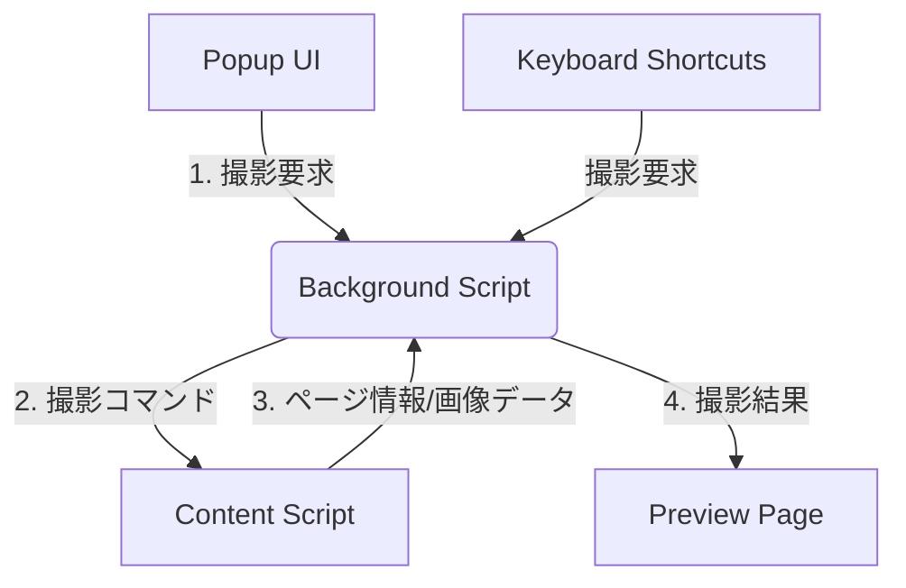

## 概要
**目的**: この機能は、ユーザーがブラウザ上で表示されているウェブページのスクリーンショットを効率的に撮影するためのChrome拡張機能を提供します。
**ユーザー**: ウェブデザイナー、開発者、QAテスター、その他ウェブコンテンツを頻繁に共有または記録する必要があるすべてのユーザーを対象とします。
**インパクト**: この拡張機能により、手動でのスクリーンショット撮影と編集の手間が削減され、ユーザーの生産性が向上します。

### ゴール
- ユーザーがブラウザのツールバーからワンクリックでスクリーンショット撮影を開始できる。
- 「表示領域」「ページ全体」「選択範囲」の3つのモードでスクリーンショットを撮影できる。
- 撮影した画像をプレビューし、PNG形式でダウンロードまたはクリップボードにコピーできる。
- キーボードショートカットによる迅速な撮影操作をサポートする。

### 非ゴール
- 撮影した画像の高度な編集機能（テキスト追加、描画ツールなど）。
- クラウドストレージへの自動アップロード機能。
- 動画キャプチャ機能。

## アーキテクチャ

### ハイレベルアーキテクチャ
この拡張機能は、Chrome拡張機能の標準的なManifest V3アーキテクチャに従います。主要なコンポーネントは、バックグラウンドで動作するService Worker、ウェブページのコンテンツと対話するContent Script、そしてユーザーインターフェースを提供するPopupとPreview Pageで構成されます。コンポーネント間の通信は、ChromeのメッセージングAPIを介して行われます。

### 技術スタックと設計判断
**技術スタック**
- **言語**: JavaScript (ES2025)
- **UI**: HTML5, CSS3
- **対象ブラウザ**: Chrome 140 以降
- **フレームワーク**: なし (Vanilla JS)
- **ビルドツール**: なし（初期段階）
- **マニフェスト**: Chrome Manifest V3

**主要な設計判断**
- **決定**: フロントエンドフレームワーク（React, Vueなど）を導入せず、Vanilla JSを使用する。
- **コンテキスト**: 本拡張機能のUIとロジックは比較的シンプルであり、外部ライブラリへの依存を最小限に抑えることで、軽量で高速な動作を目指すため。
- **代替案**: ReactやVueを使用することでコンポーネントベースの開発が可能になるが、小規模なプロジェクトには過剰であり、ビルドプロセスが複雑化する。
- **選択したアプローチ**: 標準的なWeb APIとChrome拡張機能APIのみを利用して実装する。コンポーネントは責務に応じてJS/HTML/CSSファイルに分割する。
- **トレードオフ**: 開発速度は初期段階で若干遅くなる可能性があるが、依存関係が少なく、長期的なメンテナンス性が向上する。

## コンポーネントとインターフェース

### Manifest (manifest.json)
**責務**: 拡張機能の基本的な設定、パーミッション、各スクリプトの登録を定義する。
- **パーミッション**: `activeTab`, `scripting`, `storage`, `commands`
- **Service Worker**: `background.js`を登録
- **アクション**: `popup.html`をツールバークリック時のポップアップとして指定
- **コマンド**: キーボードショートカットを定義

### Background Script (background.js)
**責務**: 拡張機能全体のイベント管理とビジネスロジックの中核を担う。UIを持たない。
- **依存関係**: Popup、Content Script、Keyboard Shortcutsからのメッセージを受信する。
- **インターフェース**:
  - `chrome.runtime.onMessage`: 他のコンポーネントからのメッセージ（撮影モードの指定など）を受け取り、適切な処理（Content Scriptの実行など）をディスパッチする。
  - `chrome.commands.onCommand`: ユーザーが設定したキーボードショートカットをリッスンし、対応する撮影コマンドを実行する。

### Popup (popup.html, popup.js)
**責務**: ユーザーが拡張機能アイコンをクリックした際に表示されるUI。撮影モードの選択肢を提供する。
- **依存関係**: ユーザーのアクションをBackground Scriptにメッセージとして送信する。
- **インターフェース**:
  - `popup.js`内のボタンクリックイベントリスナーが`chrome.runtime.sendMessage`を呼び出し、選択された撮影モード（`captureVisible`, `captureFullPage`, `captureArea`）をBackground Scriptに通知する。

### Content Script (content_script.js)
**責務**: ウェブページのDOMと直接対話する。「選択範囲」モードでの領域選択UIの提供や、ページ全体のキャプチャのためのページ情報（高さなど）の取得を行う。
- **依存関係**: Background Scriptからの指示を受けて動作し、結果をBackground Scriptに返す。
- **インターフェース**:
  - `chrome.runtime.onMessage`: Background Scriptからのコマンド（`initCaptureArea`など）を受け取る。
  - `chrome.runtime.sendMessage`: 選択された領域の座標や、ページ全体の高さなどの情報をBackground Scriptに送信する。

### Preview Page (preview.html, preview.js)
**責務**: 撮影されたスクリーンショットのプレビューを表示し、「ダウンロード」と「クリップボードにコピー」の機能を提供する。
- **依存関係**: Background Scriptから画像データを受け取り、新しいタブで表示される。
- **インターフェース**:
  - ページの読み込み時にURLパラメータから画像データ（Data URL）を取得し、``タグに表示する。
  - 「ダウンロード」ボタンは、画像データを含む`<a>`タグのクリックをトリガーする。
  - 「クリップボードにコピー」ボタンは、`Clipboard API`を使用して画像をクリップボードに書き込む。

## データモデル
- **ユーザー設定**: `chrome.storage.local` を使用して、将来的なユーザー設定（例：デフォルトの保存形式、画質など）をキーバリュー形式で保存する。現時点では具体的なモデルは定義しない。
- **画像データ**: キャプチャされた画像は、コンポーネント間でData URL形式の文字列として受け渡しされる。

## エラーハンドリング
- **パーミッションエラー**: `chrome.scripting.executeScript`などのAPI呼び出し時に、`try...catch`ブロックと`chrome.runtime.lastError`を使用してエラーを捕捉し、コンソールにログを出力する。
- **ページキャプチャ失敗**: ページ全体のキャプチャ中にスクロールやDOMの変更で失敗した場合、ユーザーに通知はせず、処理を中断してコンソールにエラーを出力する。

## テスト戦略
- **単体テスト**: 各コンポーネントの主要なロジック（特にBackground Scriptのメッセージルーティング）は、手動でのテストを中心に検証する。
- **統合テスト**: 実際のChromeブラウザで拡張機能を読み込み、以下のシナリオをテストする。
  1. ポップアップから各撮影モードが正常に開始されること。
  2. 選択範囲モードでUIが表示され、選択した領域が正しくキャプチャされること。
  3. プレビューページで画像が表示され、ダウンロードとコピーが機能すること。
  4. 設定したキーボードショートカットで各撮影モードが直接実行されること。
- **E2Eテスト**: 様々な構造のウェブサイト（動的コンテンツ、無限スクロールなど）でページ全体のキャプチャが期待通りに動作するかを確認する。
