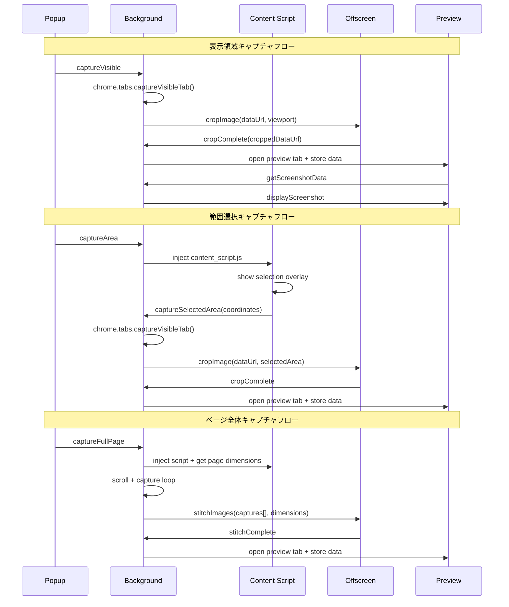

# Screenshot Extension API仕様書

## 概要
Chrome拡張機能「Screenshot Extension」の内部API仕様とメッセージフロー定義です。

### アーキテクチャパターン
- **Service Worker Pattern**: background.js が中央制御ハブ
- **Message Passing**: Chrome runtime API による非同期通信
- **Offscreen Processing**: DOM環境が必要な処理を分離
- **State Management**: TabIDベースの一時データ管理

## メッセージフロー図



## メッセージAPI

### Background Script ⇄ Popup通信

#### 撮影要求メッセージ
**送信者**: popup.js  
**受信者**: background.js

```javascript
// 表示領域キャプチャ
chrome.runtime.sendMessage({ action: 'captureVisible' });

// ページ全体キャプチャ  
chrome.runtime.sendMessage({ action: 'captureFullPage' });

// 範囲選択キャプチャ
chrome.runtime.sendMessage({ action: 'captureArea' });
```

### Background Script ⇄ Content Script通信

#### 選択範囲キャプチャ完了
**送信者**: content_script.js  
**受信者**: background.js

```javascript
chrome.runtime.sendMessage({ 
  action: 'captureSelectedArea', 
  area: {
    x: number,           // 選択範囲X座標
    y: number,           // 選択範囲Y座標  
    width: number,       // 選択範囲幅
    height: number,      // 選択範囲高さ
    devicePixelRatio: number  // デバイス倍率
  }
});
```

### Background Script ⇄ Offscreen通信

#### 画像クロップ要求
**送信者**: background.js  
**受信者**: offscreen.js

```javascript
chrome.runtime.sendMessage({
  action: 'cropImage',
  dataUrl: string,     // 元画像データURL
  area: {
    x: number,         // クロップX座標
    y: number,         // クロップY座標
    width: number,     // クロップ幅  
    height: number,    // クロップ高さ
    devicePixelRatio: number  // デバイス倍率
  }
});
```

#### 画像ステッチ要求
**送信者**: background.js  
**受信者**: offscreen.js

```javascript
chrome.runtime.sendMessage({
  action: 'stitchImages',
  captures: string[],  // 複数画像のデータURL配列
  pageDimensions: {
    pageHeight: number,       // ページ全体高さ
    viewportHeight: number,   // ビューポート高さ
    scrollbarWidth: number,   // スクロールバー幅
    devicePixelRatio: number  // デバイス倍率
  }
});
```

#### 処理完了通知
**送信者**: offscreen.js  
**受信者**: background.js

```javascript
// クロップ完了
chrome.runtime.sendMessage({ 
  action: 'cropComplete', 
  dataUrl: string 
});

// ステッチ完了
chrome.runtime.sendMessage({ 
  action: 'stitchComplete', 
  dataUrl: string 
});
```

### Background Script ⇄ Preview通信

#### スクリーンショットデータ要求
**送信者**: preview.js  
**受信者**: background.js

```javascript
chrome.runtime.sendMessage({ 
  action: 'getScreenshotData', 
  tabId: number 
});
```

#### スクリーンショット表示
**送信者**: background.js  
**受信者**: preview.js

```javascript
chrome.tabs.sendMessage(tabId, { 
  action: 'displayScreenshot', 
  dataUrl: string,  // 画像データURL
  title: string     // ページタイトル
});
```

## Chrome API使用詳細

### Tabs API実装パターン
```javascript
// アクティブタブ取得 - エラーハンドリング付き
async function getActiveTab() {
  try {
    const [tab] = await chrome.tabs.query({ active: true, currentWindow: true });
    if (!tab) throw new Error('No active tab');
    return tab;
  } catch (error) {
    console.error('Failed to get active tab:', error);
    return null;
  }
}

// 高解像度対応キャプチャ
async function captureHighRes() {
  const options = {
    format: 'png',
    quality: 100 // PNG では無視されるが明示的に指定
  };
  return await chrome.tabs.captureVisibleTab(null, options);
}

// タブ作成とデータ受け渡し
async function openPreviewWithData(dataUrl, title) {
  const previewTab = await chrome.tabs.create({ url: 'preview.html' });
  
  // タブIDをキーとしてデータを一時保存
  screenshotData[previewTab.id] = { dataUrl, title };
  
  return previewTab;
}
```

### Scripting API実装パターン
```javascript
// コンテンツスクリプト注入 - 重複チェック付き
async function injectContentScript(tabId) {
  try {
    // 既存の注入をチェック
    const [result] = await chrome.scripting.executeScript({
      target: { tabId },
      func: () => !!document.getElementById('screenshot-overlay')
    });
    
    if (!result.result) {
      await chrome.scripting.executeScript({
        target: { tabId },
        files: ['content_script.js']
      });
    }
  } catch (error) {
    console.error('Script injection failed:', error);
  }
}

// ページ情報取得関数
async function getPageDimensions(tabId) {
  const [{ result }] = await chrome.scripting.executeScript({
    target: { tabId },
    func: () => ({
      pageHeight: Math.max(
        document.body.scrollHeight,
        document.documentElement.scrollHeight
      ),
      viewportHeight: window.innerHeight,
      scrollbarWidth: window.innerWidth - document.documentElement.clientWidth,
      devicePixelRatio: window.devicePixelRatio
    })
  });
  return result;
}

// 条件付きCSS注入
async function injectHideCSS(tabId) {
  const hideCSS = `[data-ss-hidden="true"] { visibility: hidden !important; }`;
  
  try {
    await chrome.scripting.insertCSS({
      target: { tabId },
      css: hideCSS
    });
    return () => chrome.scripting.removeCSS({ target: { tabId }, css: hideCSS });
  } catch (error) {
    console.error('CSS injection failed:', error);
    return () => {}; // no-op cleanup function
  }
}
```

### Offscreen API実装パターン
```javascript
// Offscreen ライフサイクル管理
class OffscreenManager {
  static async ensureOffscreenDocument() {
    if (await this.hasOffscreenDocument()) {
      return true;
    }
    
    try {
      await chrome.offscreen.createDocument({
        url: '/offscreen.html',
        reasons: ['DOM_PARSER'],
        justification: 'Canvas operations require DOM environment'
      });
      return true;
    } catch (error) {
      console.error('Failed to create offscreen document:', error);
      return false;
    }
  }
  
  static async hasOffscreenDocument() {
    try {
      const clients = await self.clients.matchAll();
      return clients.some(client => 
        client.url.endsWith('/offscreen.html')
      );
    } catch (error) {
      return false;
    }
  }
  
  static async cleanupOffscreenDocument() {
    try {
      await chrome.offscreen.closeDocument();
    } catch (error) {
      // Document may already be closed
      console.log('Offscreen document cleanup:', error.message);
    }
  }
}

// 使用例
async function processImage(dataUrl, area) {
  if (!await OffscreenManager.ensureOffscreenDocument()) {
    throw new Error('Failed to setup image processing environment');
  }
  
  // 画像処理を実行
  await chrome.runtime.sendMessage({
    action: 'cropImage',
    dataUrl,
    area
  });
  
  // 処理完了後にクリーンアップ
  await OffscreenManager.cleanupOffscreenDocument();
}
```

## データモデル

### ScreenshotData
```javascript
{
  dataUrl: string,  // Base64エンコードされた画像データ
  title: string     // ページタイトル
}
```

### CaptureArea
```javascript
{
  x: number,                // X座標（CSS pixel）
  y: number,                // Y座標（CSS pixel）
  width: number,            // 幅（CSS pixel）
  height: number,           // 高さ（CSS pixel）
  devicePixelRatio: number  // デバイスピクセル比
}
```

### PageDimensions
```javascript
{
  pageHeight: number,       // ページ全体高さ（CSS pixel）
  viewportHeight: number,   // ビューポート高さ（CSS pixel）
  scrollbarWidth: number,   // スクロールバー幅（CSS pixel）
  devicePixelRatio: number  // デバイスピクセル比
}
```

### ViewportDimensions  
```javascript
{
  width: number,            // ビューポート幅（CSS pixel、スクロールバー除外）
  height: number,           // ビューポート高さ（CSS pixel）
  devicePixelRatio: number  // デバイスピクセル比
}
```

### MessageEnvelope
```javascript
{
  action: string,           // アクション種別
  timestamp?: number,       // メッセージタイムスタンプ
  source?: string,          // 送信元識別子
  requestId?: string        // リクエスト追跡用ID
}
```

## エラーハンドリング

### エラー分類と対処法

#### 1. 権限関連エラー
```javascript
// スクリプト実行権限
try {
  await chrome.scripting.executeScript({...});
} catch (error) {
  console.error('Script execution failed:', error.message);
  // 対処: ページリロード後に再試行を促す
}

// タブアクセス権限
try {
  const [tab] = await chrome.tabs.query({ active: true, currentWindow: true });
  if (!tab) throw new Error('No active tab found');
} catch (error) {
  console.error('Tab access failed:', error.message);
  // 対処: 拡張機能の再読み込みを促す
}
```

#### 2. キャプチャ関連エラー
```javascript
// 表示領域キャプチャ失敗
try {
  const dataUrl = await chrome.tabs.captureVisibleTab(null, { format: 'png' });
} catch (error) {
  console.error('Capture failed:', error.message);
  // 原因: ブラウザ内部ページ、権限不足
  // 対処: 通常のWebページで再試行を促す
}

// Offscreen document作成失敗
try {
  await chrome.offscreen.createDocument({...});
} catch (error) {
  console.error('Offscreen creation failed:', error.message);
  // 対処: 既存のoffscreenドキュメントを確認・削除
}
```

#### 3. 画像処理エラー
```javascript
// Canvas処理エラー (offscreen.js)
try {
  const imageBitmap = await createImageBitmap(blob);
} catch (error) {
  console.error('Image processing failed:', error.message);
  // 原因: 破損したデータ、メモリ不足
  // 対処: より小さな範囲で再試行
}

// クリップボード操作エラー (preview.js)
try {
  await navigator.clipboard.write([new ClipboardItem({'image/png': blob})]);
} catch (error) {
  console.error('Clipboard operation failed:', error.message);
  // 原因: HTTPS要件、権限設定
  // 対処: ダウンロード機能を案内
}
```

#### 4. ネットワーク・リソースエラー
```javascript
// データURL fetch失敗
try {
  const response = await fetch(dataUrl);
  if (!response.ok) throw new Error(`HTTP ${response.status}`);
} catch (error) {
  console.error('Data fetch failed:', error.message);
  // 対処: データの再生成
}
```

## パフォーマンス最適化

### 画像処理最適化
```javascript
// OffscreenCanvas によるメインスレッド負荷軽減
const canvas = new OffscreenCanvas(width, height);
const ctx = canvas.getContext('2d');

// ImageBitmap による高速画像操作
const imageBitmap = await createImageBitmap(blob);
ctx.drawImage(imageBitmap, 0, 0);

// メモリ効率的なステッチング
for (let i = 0; i < captures.length; i++) {
  // 使用後即座にImageBitmapを解放
  imageBitmap.close?.();
}
```

### 応答性最適化
```javascript
// 非同期処理による UI blocking 回避
async function captureWithDelay() {
  await new Promise(resolve => setTimeout(resolve, 300)); // 描画完了待機
  return await chrome.tabs.captureVisibleTab();
}

// 段階的な処理進行
const captures = [];
for (let y = 0; y < pageHeight; y += viewportHeight) {
  await scrollAndCapture(y);
  // UI更新の機会を提供
  await new Promise(resolve => setTimeout(resolve, 100));
}
```

### メモリ管理
```javascript
// タブベースの一時データ管理
let screenshotData = {};

// 使用後の自動クリーンアップ
function cleanupScreenshotData(tabId) {
  delete screenshotData[tabId];
}

// プレビューページ表示後のデータ削除
chrome.tabs.sendMessage(tabId, data);
cleanupScreenshotData(tabId);
```

### 最適化指標
- **表示領域キャプチャ**: ~0.5秒 (目標)
- **メモリ使用量**: 撮影完了後に即座にクリーンアップ
- **CPU使用率**: Offscreen処理により メインスレッドへの影響最小化
- **ネットワーク**: ローカル処理のみ、外部通信なし