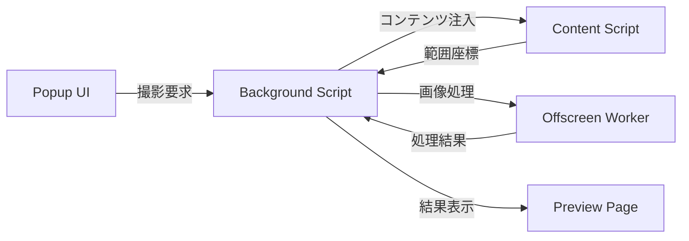

# Screenshot Extension - プロジェクトインデックス

## 📚 ドキュメント構造

### 🎯 プロジェクト概要
- [README](README.md) - プロジェクトの基本情報とセットアップ手順
- [PROJECT_INDEX.md](PROJECT_INDEX.md) - このファイル（ナビゲーション用インデックス）
- [USAGE_GUIDE.md](USAGE_GUIDE.md) - 詳細な使用方法と操作ガイド

### 📋 仕様書・設計書
- [.kiro/specs/screenshot-chrome-extension/requirements.md](.kiro/specs/screenshot-chrome-extension/requirements.md) - 要求仕様書
- [.kiro/specs/screenshot-chrome-extension/design.md](.kiro/specs/screenshot-chrome-extension/design.md) - 設計仕様書  
- [.kiro/specs/screenshot-chrome-extension/tasks.md](.kiro/specs/screenshot-chrome-extension/tasks.md) - 実装タスク管理
- [API.md](API.md) - 内部API仕様とメッセージフロー定義（シーケンス図・エラーハンドリング込み）

### 🔧 開発ガイド
- [CLAUDE.md](CLAUDE.md) - Claude開発者向け指示書
- [GEMINI.md](GEMINI.md) - Gemini Spec-Driven Development設定

## 🏗️ アーキテクチャマップ

### Core Components
```
├── manifest.json          # Chrome拡張設定
├── background.js          # Service Worker（メインロジック）
├── popup.html/js/css      # 撮影モード選択UI
├── content_script.js      # 範囲選択機能
├── offscreen.html/js      # 画像処理環境
└── preview.html/js/css    # 結果表示・保存UI
```

### データフロー


## 📁 ファイル参照

### 🎨 UI Components
| ファイル | 役割 | 主要機能 |
|---------|------|----------|
| [popup.html](popup.html) | メイン操作UI | 3種類の撮影モード選択 |
| [popup.js](popup.js) | UI制御ロジック | ボタンイベント → メッセージ送信 |
| [popup.css](popup.css) | UI スタイル | ボタンレイアウト・ホバー効果 |
| [preview.html](preview.html) | 結果表示UI | 画像プレビュー・保存操作 |
| [preview.js](preview.js) | プレビュー制御 | ダウンロード・クリップボード機能 |
| [preview.css](preview.css) | プレビュースタイル | 画像表示・ボタンスタイル |

### ⚙️ Core Logic  
| ファイル | 役割 | 主要機能 |
|---------|------|----------|
| [background.js](background.js) | メインロジック | 撮影統合・タブ管理・メッセージ配信 |
| [content_script.js](content_script.js) | ページ操作 | 範囲選択UI・座標取得 |
| [offscreen.js](offscreen.js) | 画像処理 | クロップ・ステッチ・Canvas操作 |
| [offscreen.html](offscreen.html) | 処理環境 | DOM環境（Canvas用） |

### 📄 Configuration
| ファイル | 役割 | 内容 |
|---------|------|------|
| [manifest.json](manifest.json) | 拡張設定 | 権限・スクリプト登録・Manifest V3 |

## 🔗 機能別クロスリファレンス

### 📸 撮影モード実装

#### 🖥️ 表示領域キャプチャ
- **UI**: [popup.html:7](popup.html#L7) → [popup.js:6-8](popup.js#L6-L8)
- **処理**: [background.js:50-82](background.js#L50-L82)
- **API**: `chrome.tabs.captureVisibleTab()` + ビューポート計算

#### 📄 ページ全体キャプチャ  
- **UI**: [popup.html:8](popup.html#L8) → [popup.js:10-12](popup.js#L10-L12)
- **処理**: [background.js:108-204](background.js#L108-L204)
- **画像結合**: [offscreen.js:46-102](offscreen.js#L46-L102)

#### 🎯 範囲選択キャプチャ
- **UI**: [popup.html:9](popup.html#L9) → [popup.js:14-16](popup.js#L14-L16)
- **選択**: [content_script.js:1-84](content_script.js#L1-L84)
- **処理**: [background.js:83-102](background.js#L83-L102)
- **クロップ**: [offscreen.js:9-44](offscreen.js#L9-L44)

### 💾 保存・共有機能

#### 📥 ダウンロード機能
- **UI**: [preview.html:12](preview.html#L12) → [preview.js:28-37](preview.js#L28-L37)
- **ファイル名**: `screenshot-{ページタイトル}-{日時}.png`

#### 📋 クリップボード機能
- **UI**: [preview.html:13](preview.html#L13) → [preview.js:39-53](preview.js#L39-L53)
- **API**: `navigator.clipboard.write()` + `ClipboardItem`

### 🔧 技術要素

#### 🎨 Canvas画像処理
- **環境**: [offscreen.html](offscreen.html) + [offscreen.js](offscreen.js)
- **技術**: `OffscreenCanvas` + `createImageBitmap()`
- **対応**: 高DPI・デバイス倍率

#### 📡 メッセージング
- **実装**: [API.md - メッセージAPI](API.md#メッセージapi)
- **フロー**: popup ⇄ background ⇄ content/offscreen ⇄ preview

#### 🔐 権限管理
- **設定**: [manifest.json:6-11](manifest.json#L6-L11)
- **必要権限**: `activeTab`, `scripting`, `offscreen`, `tabs`

## 🧪 テスト・デバッグ

### 🔍 デバッグポイント
- **Background Script**: [background.js:21](background.js#L21) - メッセージ受信ログ
- **Content Script**: [content_script.js:75-82](content_script.js#L75-L82) - 範囲選択完了
- **Preview**: [preview.js:41-52](preview.js#L41-L52) - クリップボード操作

### ⚠️ エラーハンドリング
- **キャプチャ失敗**: [background.js:80-82](background.js#L80-L82), [background.js:100-102](background.js#L100-L102)
- **権限エラー**: [background.js:175-178](background.js#L175-L178)
- **クリップボード失敗**: [preview.js:49-52](preview.js#L49-L52)

## 📈 開発ロードマップ

### ✅ 完了済み機能
- [x] 基本的な3モード撮影機能
- [x] 画像プレビュー・保存機能  
- [x] 高DPI対応・Canvas処理
- [x] 範囲選択UI

### 🔄 改善予定
- [ ] キーボードショートカット ([tasks.md:50-53](.kiro/specs/screenshot-chrome-extension/tasks.md#L50-L53))
- [ ] エラーUI改善
- [ ] パフォーマンス最適化

## 🎓 学習リソース

### Chrome拡張関連
- [Chrome Extensions API](https://developer.chrome.com/docs/extensions/)
- [Manifest V3 Migration](https://developer.chrome.com/docs/extensions/migrating/)
- [Offscreen API Guide](https://developer.chrome.com/docs/extensions/reference/offscreen/)

### 画像処理関連
- [Canvas API](https://developer.mozilla.org/docs/Web/API/Canvas_API)
- [OffscreenCanvas](https://developer.mozilla.org/docs/Web/API/OffscreenCanvas)
- [Clipboard API](https://developer.mozilla.org/docs/Web/API/Clipboard_API)